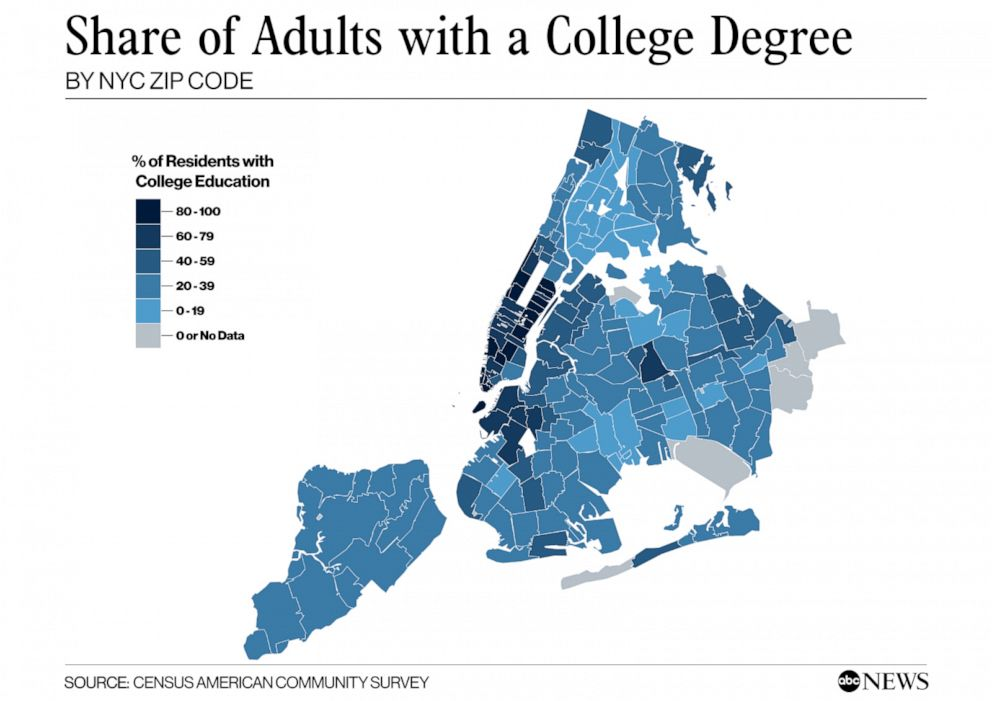

# Part 1

## Purpose

On April 10, 2020, [ABC News](https://abcnews.go.com/Health/nyc-stark-contrast-covid-19-infection-rates-based/story?id=69920706) covered an online report (by the NYU Furman Center) that examined cases of COVID-19 in New York City on a neighborhood level. Most COVID-19 data that had been coming out had been reporting on the city as a whole. The main idea here was that neighborhoods tell a different story. Data scientist call this a shift in the unit-of-analysis. The city is made of boroughs, which themselves are made up of smaller neighborhoods. So the unit of analysis could be the whole city, the boroughs of the city, or something even more fine-grained, like neighborhoods or zipcode areas. For example, some zipcodes are wealthier and some poorer. Zipcode areas also vary by racial composition. If we examine COVID-19 outcomes by neighborhood, we may be able to see patterns and associations between disease incidence and race or socio-economic variables. Indeed, the Furman Center found such associations. The ABC News report produced images like the following:

 

People familiar with the layout of New York City might be able to identify low-income and largely African-American neighborhoods like Hunts Point in the South Bronx.  ABC News produced a corresponding map showing the share of adults with college degree, a measure of educational attainment which the Furman Center report said was associated with disease incidence.



It requires switching back and forth between these images, but the dark regions on the COVID map (higher rates of disease) seem to often correspond to the lighter regions on the college degree map (lower college share). In other words, areas with lower educational attainment seem to have higher rates of the disease. There are many possible explanations of this relationship, which are discussed in the Furman report and elsewhere.
 
How does one make these data visualizations? And are they the best way to "see" the signals in the data?

ABC News also reproduced a version of table below, showing racial composition by neighborhood. The title may confuse matters, however. In this table, multiple neighborhoods (zipcodes) are actually grouped together into five sets using **quintiles.** You take all of the zipcodes, rank-order them by COVID-19 concentration, and then select the bottom fifth, the next fifth, and so on up to the top fifth. These groups are labeled "lowest concentration", "low concentration", and so on up to "highest concentration."

Technically, the quintiles are the cut-points, so for five groups, there are four quintiles. If you look at the table below, the cut-points/quintiles are {3.33, 4.13, 4.77, 5.87}. Of course, this division process can be done for a different number of **quantiles**--note the spelling--not necessarily five. A division of three groups is made by choosing two (cut-point) tertiles or terciles. The median is the 2-quantile, as it is the cut-point that divides a data set into two equal parts. Unfortunately, the naming conventions here are rather confusing, but you get used to them if you use them a lot.


If you look at the table above, you may notice trends or patterns between racial composition (of these groups of neighborhoods) and COVID-19 concentration. The trends are not perfectly linear. But, for example, the proportion of Black and Hispanic people in the low-concentration neighborhoods is 37.3%. While in the high concentration neighborhoods, this combined share is 55.6%.

In the remainder of this tutorial, we will examine how to recreate graphs and tables like the one above from publicly available data. This will enable you to create your own versions or update the ones above with new data. We will also look at alternative representations and at some simulation-based tests to see how likely it is that such disparities might occur by chance.

Let's begin!

# Getting some data

In this tutorial, I will walk you through the steps of creating some of the figures and tables that go into media reports about COVID-19 outcomes. The examples here are all NYC-centric, but the methods, especially for US Census data, are completely general. The hardest part of all of this--and this is generally true about the practice of data science--is getting all of the data from different sources cleaned up and fitted together.


## Local data on COVID from the city and/or state

For state and municipality-level COVID-19 data in New York, these are some sources:

+ https://www1.nyc.gov/site/doh/covid/covid-19-data-archive.page
+ https://github.com/nychealth/coronavirus-data
+ https://health.data.ny.gov/Health/New-York-State-Statewide-COVID-19-Testing/xdss-u53e

These sources are updated daily. I will be working with the GitHub data as of April 23. This is actually two weeks later than the Furman/ABC reports, so more up-to-date. I downloaded the files from the online repository and put them into a folder on my computer. For example, here I will load and view the borough-level data table. 

```{r}
nyc_boro_data <- read.csv("data/coronavirus-nyc/boro.csv", stringsAsFactors = F)
nyc_boro_data
```

According to the documentation in the GitHub README file (a valuable source of information), this table contains rates of confirmed cases, by NYC borough of residence. Rates are:

+ Cumulative since the start of the outbreak
+ Age adjusted according to [the US 2000 standard population](https://www.cdc.gov/nchs/data/statnt/statnt20.pdf)
+ Per 100,000 people in the borough

What does age-adjusted rate mean? You can read the link, but the main idea here is to try to put all of the boroughs on equal footing in the rate per 100,000 people, even if some boroughs have an older or younger population than others. Which it turns out they do. Later, once we have borough populations, we could examine simple population-adjusted rates that are not age-adjusted and see what those look like in comparison.

If we wanted to do age-adjustment, or even simpler population adjustment, we would need to supplement this COVID data with population data, for example obtained from the US Census. Before we turn to that, let us just quickly explore the other data provided by NYC.

```{r}
nyc_sex_data <- read.csv("data/coronavirus-nyc/by-sex.csv")
nyc_sex_data
```

(By the way, you may get a warning like, "incomplete final line found" when reading this file. You can ignore it. R is expecting each line in a .csv file to end with a newline/return. You can also just open the file and add that newline after the last row if you like). 

Case and fatality rates by sex show that males are being infected and dying at significantly higher rates. Note that each of these is already adjusted to rate per 100,000.

```{r}
nyc_age_data <- read.csv("data/coronavirus-nyc/by-age.csv")
nyc_age_data
```

Age-level data show a few interesting features. For one, children are barely even getting infected. Among adults, infection rates are slightly higher for older adults, but death rates are much higher. We could derive a measure of case fatality rate (CFR) as follows:

```{r}
nyc_age_data$CFR <- round(nyc_age_data$DEATH_RATE/nyc_age_data$COVID_CASE_RATE, 3)
nyc_age_data
```

From this we see that adults 75 and older have a `r paste0(nyc_age_data$CFR[5]*100,"%")` chance of dying from COVID-19, compared to a `r paste0(nyc_age_data$CFR[3]*100,"%")` for adults between 45-64.


**Exercise**: compute the case fatality rate by sex.

The most captivating data set provided by the city (hence the images we started out with) is probably the zipcode-level data, the first few rows of which look like this:


```{r}
nyc_zipcode_data <- read.csv("data/coronavirus-nyc/tests-by-zcta.csv")
head(nyc_zipcode_data,20)
```

Notice that the first row is missing a zipcode. Presumably these are COVID tests for which we do not know where the people who were tested actually reside.

For each other row, we have a zipcode, the number of positive tests, the number of total tests, and the percent positive.

**Exercise**: Which of these expressions should give the percent positive tests

+ `nyc_zipcode_data$Total/nyc_zipcode_data$Positive*100`
+ `nyc_zipcode_data$Positive/nyc_zipcode_data$Total`
+ `nyc_zipcode_data$Positive/nyc_zipcode_data$Total*100`
+ `(nyc_zipcode_data$Total-nyc_zipcode_data$Positive)`
+ `(nyc_zipcode_data$Total-nyc_zipcode_data$Positive)*100`


Finally, you might want to keep the first row, the one with the missing zipcode, in your data. But I would rather remove it now, because I'm going to try to add information to this zipcode table down the line. While I'm at it, I will also rename the column "MODZCTA" with "zipcode."


```{r}
nyc_zipcode_data <- na.omit(nyc_zipcode_data)
names(nyc_zipcode_data)[1] <- "zipcode"
head(nyc_zipcode_data)
```

There are a couple more tables included in the GitHub repository, for example ones showing the daily tracking of new cases, hospitalizations, and deaths. But as we are focusing on the neighborhood level counts, I will leave them out of these notes. 

In the next part of the series, we will get started with US Census data.
