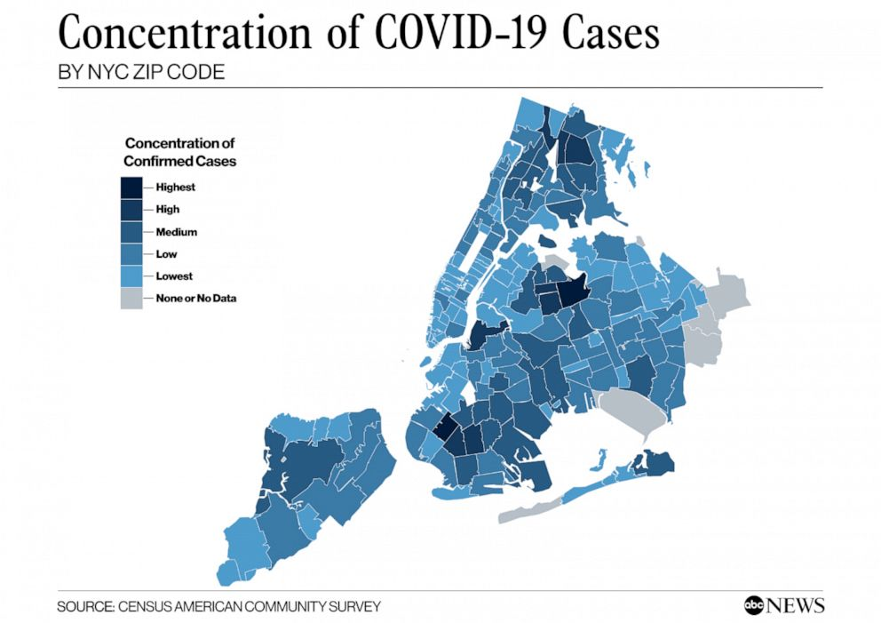

```{r global_options, include=FALSE}
knitr::opts_chunk$set(fig.width=12, fig.height=8, fig.path='figs/',
                      echo=TRUE, warning=FALSE, message=FALSE)
```


## Prologue {-}

Although Madonna may have called COVID-19 [the great equalizer](https://pagesix.com/2020/03/22/madonna-calls-coronavirus-the-great-equalizer-in-bizarre-bathtub-video/){target="_blank"}, others have highlighted some data that suggest the opposite may be true. Whenever we acknowledge the range of human experience, in the case of disease as in other cases, variance in outcomes does not necessarily imply systematic unfairness. For example, if COVID-19 is more fatal for elderly adults, as it appears to be, this is not something we would label as obviously unfair. Everyone gets old, and physical deterioration unfortunately comes with the territory. Certain chronic health conditions make people more vulnerable to COVID-19, but some of those conditions might just be the result of bad luck. We can try to make a world in which everyone has comparable access to healthcare, but we probably still can’t make a world in which everyone has the same health outcomes.

However, consider the following headlines:

+ [Why African-Americans may be especially vulnerable to COVID-19](https://www.sciencenews.org/article/coronavirus-why-african-americans-vulnerable-covid-19-health-race){target="_blank"}

+ [Coronavirus Numbers Reflect New York City’s Deep Economic Divide](https://theintercept.com/2020/04/09/nyc-coronavirus-deaths-race-economic-divide/){target="_blank"}

+ [In NYC, 'stark contrast' in COVID-19 infection rates based on education and race](https://abcnews.go.com/Health/nyc-stark-contrast-covid-19-infection-rates-based/story?id=69920706){target="_blank"}

+ [Who gets hospitalized for Covid-19? Report shows differences by race and sex](https://www.statnews.com/2020/04/09/hospitalized-covid-19-patients-differences-by-race-and-sex/){target="_blank"}

When adverse health outcomes are associated with income, race, and/or sex, we are much more likely to cry foul than when they are associated with age or pre-existing chronic conditions. Part of this has to do with the difference between variance among individuals, which is an unavoidable fact of life, and variance between certain classes or groups. These media reports are all suggesting that COVID-19 may not be affecting all groups with the same severity. What exactly does that mean, and is it evidence of unfairness?

New York City has emerged as the epicenter of the US outbreak, claiming over 14,000 lives as of the time of this writing. As specific data have become available, researchers and reporters have examined counts of coronavirus infections and/or deaths by zip code and borough, by age, sex, and race. In this chapter, we will take a closer look at the data and the media reports.

Some additional reports on Coronavirus in New York:

+ [COVID-19 Cases in New York City, a Neighborhood-Level Analysis](https://furmancenter.org/thestoop/entry/covid-19-cases-in-new-york-city-a-neighborhood-level-analysis){target="_blank"}
+ [Coronavirus Statistics: Tracking The Epidemic In New York](https://gothamist.com/news/coronavirus-statistics-tracking-epidemic-new-york){target="_blank"}


There are a bunch of sites that let you engage interactively with COVID-19 data. The purpose of this chapter is to show you how to build your own resource.


## COVID NYC {#part1}

On April 10, 2020, [ABC News](https://abcnews.go.com/Health/nyc-stark-contrast-covid-19-infection-rates-based/story?id=69920706){target="_blank"} covered an online report (by the NYU Furman Center) that examined cases of COVID-19 in New York City on a neighborhood level. Most COVID-19 data that had been coming out had been reporting on the city as a whole. The main idea here was that neighborhoods tell a different story. Data scientists call this a shift in the unit-of-analysis. The city is made of boroughs, which themselves are made up of smaller neighborhoods. So the unit of analysis could be the whole city, the boroughs of the city, or something even more fine-grained, like neighborhoods or zipcode areas. For example, some zipcodes are wealthier and some poorer. Zipcode areas also vary by racial composition. If we examine COVID-19 outcomes by neighborhood, we may be able to see patterns and associations between disease incidence and race or socio-economic variables. Indeed, the Furman Center found such associations. The ABC News report produced images like the following:

 

People familiar with the layout of New York City might be able to identify low-income and largely African-American neighborhoods like Hunts Point in the South Bronx.  ABC News produced a corresponding map showing the share of adults with college degree, a measure of educational attainment which the Furman Center report said was associated with disease incidence.


It requires switching back and forth between these images, but the dark regions on the COVID map (higher rates of disease) seem to often correspond to the lighter regions on the college degree map (lower college share). In other words, areas with lower educational attainment seem to have higher rates of the disease. There are many possible explanations of this relationship, which are discussed in the Furman report and elsewhere.
 
How does one make these data visualizations? And are they the best way to "see" the signals in the data?

ABC News also reproduced a version of table below, showing racial composition by neighborhood. The title may confuse matters, however. In this table, multiple neighborhoods (zipcodes) are actually grouped together into five sets using **quintiles.** You take all of the zipcodes, rank-order them by COVID-19 concentration, and then select the bottom fifth, the next fifth, and so on up to the top fifth. These groups are labeled "lowest concentration", "low concentration", and so on up to "highest concentration."

To make matters confusing, the word "quintile" is often used referring to the five sets (for example, "the lower quintile"). But strictly speaking, the quintiles are actually the cut-points. So for five groups, there are four quintiles. If you look at the table below, the cut-points/quintiles are {3.33, 4.13, 4.77, 5.87}. Of course, this division process can be done for a different number of **quantiles**--note the spelling--not necessarily five. A division of three groups is made by choosing two (cut-point) tertiles or terciles. The median is the 2-quantile, as it is the cut-point that divides a data set into two equal parts. Unfortunately, the naming conventions here are rather confusing, but you get used to them if you use them a lot.


If you look at the table above, you may notice trends or patterns between racial composition (of these groups of neighborhoods) and COVID-19 concentration. The trends are not perfectly linear. But, for example, the proportion of Black and Hispanic people in the low-concentration neighborhoods is 37.3%. While in the high concentration neighborhoods, this combined share is 55.6%.

In the remainder of this tutorial, we will examine how to recreate graphs and tables like the one above from publicly available data. This will enable you to create your own versions or update the ones above with new data. We will also look at alternative representations and at some simulation-based tests to see how likely it is that such disparities might occur by chance.

Let's begin!

### Getting some data {-}

In this tutorial, I will walk you through the steps of creating some of the figures and tables that go into media reports about COVID-19 outcomes. The examples here are all NYC-centric, but the methods, especially for US Census data, are completely general. The hardest part of all of this--and this is generally true about the practice of data science--is getting all of the data from different sources cleaned up and fitted together.


### Local data on COVID from the city and/or state {-}

For state and municipality-level COVID-19 data in New York, these are some sources:

+ [NYC data summaries](https://www1.nyc.gov/site/doh/covid/covid-19-data-archive.page){target="_blank"}
+ [NYC Health GitHub](https://github.com/nychealth/coronavirus-data){target="_blank"}
+ [NY Statewide data](https://health.data.ny.gov/Health/New-York-State-Statewide-COVID-19-Testing/xdss-u53e){target="_blank"}

These sources are updated daily. I will be working with the GitHub data as of April 23. This is actually two weeks later than the Furman/ABC reports, so more up-to-date. I downloaded the files from the online repository and put them into a folder on my computer. For example, here I will load and view the borough-level data table. 

```{r}
nyc_boro_data <- read.csv("data/coronavirus-nyc/boro.csv", stringsAsFactors = F)
nyc_boro_data
```

According to the documentation in the GitHub README file (a valuable source of information), this table contains rates of confirmed cases, by NYC borough of residence. Rates are:

+ Cumulative since the start of the outbreak
+ Age adjusted according to [the US 2000 standard population](https://www.cdc.gov/nchs/data/statnt/statnt20.pdf){target="_blank"}
+ Per 100,000 people in the borough

What does age-adjusted rate mean? You can read the link, but the main idea here is to try to put all of the boroughs on equal footing in the rate per 100,000 people, even if some boroughs have an older or younger population than others. Which it turns out they do. Later, once we have borough populations, we could examine simple population-adjusted rates that are not age-adjusted and see what those look like in comparison.

If we wanted to do age-adjustment, or even simpler population adjustment, we would need to supplement this COVID data with population data, for example obtained from the US Census. Before we turn to that, let us just quickly explore the other data provided by NYC.

```{r}
nyc_sex_data <- read.csv("data/coronavirus-nyc/by-sex.csv")
nyc_sex_data
```

(By the way, you may get a warning like, "incomplete final line found" when reading this file. You can ignore it. R is expecting each line in a .csv file to end with a newline/return. You can also just open the file and add that newline after the last row if you like). 

Case and fatality rates by sex show that males are being infected and dying at significantly higher rates. Note that each of these is already adjusted to rate per 100,000.

```{r}
nyc_age_data <- read.csv("data/coronavirus-nyc/by-age.csv")
nyc_age_data
```

Age-level data show a few interesting features. For one, children are barely even getting infected. Among adults, infection rates are slightly higher for older adults, but death rates are much higher. We could derive a measure of case fatality rate (CFR) as follows:

```{r}
nyc_age_data$CFR <- round(nyc_age_data$DEATH_RATE/nyc_age_data$COVID_CASE_RATE, 3)
nyc_age_data
```

From this we see that adults 75 and older have a `r paste0(nyc_age_data$CFR[5]*100,"%")` chance of dying from COVID-19, compared to a `r paste0(nyc_age_data$CFR[3]*100,"%")` for adults between 45-64.


**Exercise**: compute the case fatality rate by sex.

Since I'm going to be using this method later, there is another way to add a new CFR variable to the table using the `mutate` function in the `dplyr` package. It looks slightly more complicated, but it has benefits which I won't get into now. The important thing here is just to recognize that there are different ways of achieving the same ends.

```{r}
# the way from before
# nyc_age_data$CFR <- round(nyc_age_data$DEATH_RATE/nyc_age_data$COVID_CASE_RATE, 3)

# another way using dplyr
library(dplyr)
nyc_age_data <- nyc_age_data %>% mutate(CFR = round(DEATH_RATE/COVID_CASE_RATE,3))
nyc_age_data
```


The most captivating data set provided by the city (hence the images we started out with) is probably the zipcode-level data, the first few rows of which look like this:

```{r}
nyc_zipcode_data <- read.csv("data/coronavirus-nyc/tests-by-zcta.csv")
head(nyc_zipcode_data,20)
```

Notice that the first row is missing a zipcode. Presumably these are COVID tests for which we do not know where the people who were tested actually reside.

For each other row, we have a zipcode, the number of positive tests, the number of total tests, and the percent positive.

**Exercise**: Which of these expressions should give the percent positive tests?

```
nyc_zipcode_data$Total/nyc_zipcode_data$Positive*100
nyc_zipcode_data$Positive/nyc_zipcode_data$Total
nyc_zipcode_data$Positive/nyc_zipcode_data$Total*100
(nyc_zipcode_data$Total-nyc_zipcode_data$Positive)
(nyc_zipcode_data$Total-nyc_zipcode_data$Positive)*100
```


Now you might want to keep the first row, the one with the missing zipcode, in your data. But I would rather remove it now, because I'm going to try to add information to this zipcode table down the line. While I'm at it, I will also rename the column "MODZCTA" with "zipcode."


```{r}
nyc_zipcode_data <- na.omit(nyc_zipcode_data)
names(nyc_zipcode_data)[1] <- "zipcode"
head(nyc_zipcode_data)
```

There are a couple more tables included in the GitHub repository, for example ones showing the daily tracking of new cases, hospitalizations, and deaths. But as we are focusing on the neighborhood level counts, I will leave them out of these notes. 

In the next part of the series, we will get started with US Census data.


## Getting started with US Census data {#part2}

To get census data, you can go to (https://data.census.gov/), but be warned: it is a big maze and not that easy to navigate. What the pros who make media reports do (probably) is use the US Census API to make specific requests for data. If you use it a lot, you will need an API key. This is easy enough to get, but you need to [request one here](https://api.census.gov/data/key_signup.html){target="_blank"}. Once you have a key, you can declare it in your R code or, better for security/code-sharing, embed it in a .Renviron file. 

Here I will load the `censusapi` package (and also `dplyr` while I'm at it), and load my key. You can modify this line with your key. If you don't have one, some or all of the code below will still work if you comment out the `key=myKey`. Without an API key, however, there is a limit to the size and number of queries per IP address.

```{r include = FALSE}
# You may need your own key; or try commenting out the key lines in the getCensus queries
myKey <- Sys.getenv("CENSUS_KEY") 
```

```{r}
library(censusapi)
library(dplyr)
# comment this out if you want to proceed without a key
# myKey = Sys.getenv("CENSUS_KEY") #store your key in .Renviron
```


More importantly, when it comes to census data, you need to know what you're asking for. That means you need to know which data sets, which variables, which geographic units, etc. A brief introductory [API users guide can be found here](https://www.census.gov/content/dam/Census/data/developers/api-user-guide/api-guide.pdf){target="_blank"}. It's 20 pages long. You can just follow along here if you want some examples.

We will be interested in the [American Community Survey 5-Year data](https://www.census.gov/data/developers/data-sets/acs-5year.html){target="_blank"} (aka ACS5) which provides estimates aggregated over a 5-year period, revisited every two years. The last published data set, i.e., the most current one available, is from 2018.

### Census Variables {-}

There are something like 20,000 variables available in ACS, and these can be retrieved through queries invidividually or in groups. Some useful groups for our analysis are the following

+ B01001	SEX BY AGE	
  + This has a lot of subcategories, such as Male 5-9 Years, Male 10-14 years, etc.
+ B02001	RACE (disregards Hispanic or Latino Origin)	
+ B03002	HISPANIC OR LATINO ORIGIN BY RACE	
+ B19013	MEDIAN HOUSEHOLD INCOME IN THE PAST 12 MONTHS

For each group, a list of variables can be found on a corresponding census.gov website. For example, to find the variables in the SEX BY AGE group, you can go to https://api.census.gov/data/2018/acs/acs5/groups/B01001.html (notice the URL ending is the same as the group). There you will find variables such as

+ B01001_001E	Estimate!!Total
+ B01001_002E	Estimate!!Total!!Male
+ B01001_026E	Estimate!!Total!!Female

And many more. Variables that end in E are estimates. For each one there is often a margin of error, which is the same code ending in M instead of E. Finally for both estimates and margins of error, there may be annotations (e.g. B01001_002EA and B01001_002MA), if these numbers are missing or not straightforward. Details about annotation meanings can be found [here](https://www.census.gov/data/developers/data-sets/acs-1year/notes-on-acs-estimate-and-annotation-values.html){target="_blank"}. This is just an overview of what the ACS5 variable names look like.

### Geography Units {-}

Census data are available at many levels related to geographical units. The smallest unit is called a census "block" and typically covers between 600 and 3000 people. A collection of blocks forms a census tract (2500 to 8000 people). But US states are also divided into counties, and both state and county identifiers can be used as region selectors. Note that to use the Census API, one has to use numerical identifiers for states and counties. For example, the borough of Brooklyn is actually Kings County, New York, which is county 047 in state 36. And yes, you have to include all three digits, including the leading zero, to identify individual counties. Zipcode tabulation areas (aka ZCTA) is another option, wherein you specify the five-digit zip code. We will want to use that, because NYC provided COVID-19 testing data at the zipcode level. 

#### Borough-level data {-}

First, let's retrieve some data about the five boroughs. Let's start with the simplest example and get the size of each borough population.

We will need to request the variable B01001_001E, which is the total population estimate. 

```{r echo=TRUE}
acs_boro_population <- getCensus(name = "acs/acs5",
                         vintage = 2018,
                         vars = c("NAME", "B01001_001E"),
                         region = "county:005,047,061,081,085",
                         regionin = "state:36" , key = myKey
                         )

acs_boro_population
```

Cool! We've established that we can pull some borough-level information from the US Census to complement data provided by the city or state. Note that the two tables, the one from NYC and the one from the census, don't exactly match up. For one thing, the county names do not align with the borough names.

#### Using named vectors as look-up tools {-}

Now, we can fix this by hand, but there are good ways and less good ways to do this. Ideally, we create a look-up table which we can reuse whenever we need to switch between borough and county names. For those familiar with database "join" operations, it is indeed possible to use joins in R. However, a simple way to just convert between two different representations (e.g., country name and borough name) is to use "named vectors" in R. Here's how:

```{r}
# Borough names
boroNames <- nyc_boro_data$BOROUGH_GROUP[1:5]
# County names
countyNames <- acs_boro_population$NAME

# combine, but note that the order is not the same! So we'll reorder
boro2county <- data.frame(Borough=boroNames, County=countyNames[c(5,2,3,1,4)], 
                          stringsAsFactors = FALSE)

# create two 'named vectors'
# one for getting the borough
getBoro <- boro2county$Borough
names(getBoro) <- boro2county$County

# one for getting the county
getCounty <- boro2county$County
names(getCounty) <- boro2county$Borough

```

Here's is one way we can use this new lookup table. Note that `getBoro` is not a function (it is a named vector). So we use square brackets to index it, not parentheses.

```{r}
getBoro["Richmond County, New York"]
getCounty["Brooklyn"]
```

```{r}
acs_boro_population$Borough <- getBoro[acs_boro_population$NAME]
acs_boro_population
```

All that remains is that annoying variable name B01001_001E for Total Population. We should definitely fix this, and there are a few ways to do it. The following may seem like a long-winded way to go about it, but it has the benefit that it will work no matter where the variable B01001_001E appears. It won't accidentally change the wrong column name, and it won't do anything at all if the variable you are trying to rename doesn't exist.

```{r}
names(acs_boro_population)[which(names(acs_boro_population)=="B01001_001E")] <- "Total_Pop"
names(acs_boro_population)[which(names(acs_boro_population)=="NAME")] <- "countyName"
acs_boro_population
```

(If you're wondering whether we could have used named vectors to convert between the ACS names, like B01001_001E, and simple names like "Total_Pop", then yes, but you're getting ahead of me. Once we have more than a few of these variables, that would indeed be a good idea.) 

With this in hand, we can now combine our NYC COVID-19 data with our Census data. Let's bring back our first borough table: 

```{r}
nyc_boro_data
```

We will make some judicious use of dplyr here to simplify the outcome. Mostly, we want to get rid of unnecessary columns from the ACS table (using `select`), and then use `join()` to merge the two tables. The advantage of the pipe operatore `%>%` is that it allows us to think of our data as going through a flow of operations. First we take our table of data, then we select the columns we care about, then we combine it with our other table (the NYC data on COVID-19):

```{r}
boro_join <- acs_boro_population %>% select(Borough, countyName, Total_Pop) %>% 
  left_join(nyc_boro_data, by=c("Borough" =  "BOROUGH_GROUP"))
boro_join
```

Woohoo! (I'm keeping countyName for later. You'll see why.)

**Worked Example**: Compute the population adjusted rate per 100,000 people using population data from the census. How does it differ from the age-adjusted rate? 

We can use our population estimates (keep in mind that these are 5-year averages as of 2018) to derive our own rate-per-100,000 as follows

```{r}
boro_join$RATE_100K <-  round(boro_join$COVID_CASE_COUNT/boro_join$Total_Pop * 100000, 2)
boro_join %>% select(Borough, COVID_CASE_RATE, RATE_100K)
```

You'll notice that our rate, which is not age-adjusted, differs somewhat from the NYC rate, which is age-adjusted. Aside from age-adjustment, it is possible that our population numbers (based on 5-year averages) are different from the latest NYC populations estimates. If our population numbers are lower, then our rates would be higher. Or the difference could be a result of the age-adjustment formula.

<!-- ```{r} -->

<!-- boro_join %>% select(Borough, COVID_CASE_RATE, RATE_100K) %>% -->
<!--   mutate(normCR1 = round(COVID_CASE_RATE/COVID_CASE_RATE[3],2),  -->
<!--          normCR2 = round(RATE_100K/RATE_100K[3],2)) -->

<!-- ``` -->


#### More variables: income, age, and race {-}

To request the median household income we will request the variable "B19013_001E" (intuitive, right?) Alternatively, the variable B20017_001E is earnings per person not by household. Why not examine both?

```{r echo=TRUE}
acs_boro_income <- getCensus(name = "acs/acs5",
                         vintage = 2018,
                         vars = c("NAME", "B19013_001E", "B20017_001E"),
                         region = "county:005,047,061,081,085",
                         regionin = "state:36" , key = myKey
                         )

names(acs_boro_income)[which(names(acs_boro_income)=="B19013_001E")] <- "Median_HH_Income"
names(acs_boro_income)[which(names(acs_boro_income)=="B20017_001E")] <- "Median_Income"
acs_boro_income
```
There it is, five-year averages, inflation-adjusted for 2018 dollars, by borough. (If you see one-year estimates, they may  be a bit higher than these numbers, if wages went up faster than inflation).

We can add these new income variables to the table we've started to build

```{r}
# Note that I am renaming NAME to countyName in the select(), 
# so I didn't have to do it ahead of time

left_join(boro_join, 
          acs_boro_income %>% select(countyName=NAME, Median_HH_Income, Median_Income), 
          by="countyName")

```

In the next part of the series, we will keep assembling more variables related to age and race. We will also eventually change our unit of analysis to zipcode tabulation areas.


## More (and messier) Census data {#part3}

### Exploring the ACS data {-}

So far, we have been selecting one or two variables at a time, because we knew what we were looking for. Sometimes, though, you're not exactly sure what variables are in the data. Moreoever, since many of the ACS tables combine categories (such as SEX BY AGE), the number of variables grows exponentially (e.g., as the number of SEX categories times the number of AGE categories). Add to that the margin-of-error and annotation variables, and the list gets overwhelming fast.

Even data from the SEX BY AGE group (B01001), which seems simple, is rather complicated-looking! I will walk through it deliberately, as I would do if I were exploring the data for the first time and not sure what I was going to find.

First, I will use the function `listCensusMetadata` to request all of the variables in the group B01001 and see what we see.

```{r}
# a list of groups can be found here; there are 1135 of them!
# acs_groups <- listCensusMetadata(name = "acs/acs5", vintage = 2018, type = "groups")
# head(acs_groups)

# here are the variables in the SEX BY AGE group
group_B01001 <- listCensusMetadata(name = "acs/acs5",
                                   vintage = 2018,
                                   type = "variables",
                                   group = "B01001")
head(group_B01001[order(group_B01001$name),], 15)

```

Ugh. Note that our table of variables here includes variable name, label, and type. For type, we have "int" for integers (numbers) and "string" which is the computational shorthand for "string of characters." This is the variable-type used for words and sentences as well as passwords or other random strings of characters. 

To make the results more readable, we can try identify the pattern in the order of the variables. First, let's observe the following. The numbers after the group name are just increasing from 001, 002, and so on. We might want to look at the middle of this list, e.g, from 020 to 030, which we can do as follows:

```{r}
myVars <- paste0("B01001_0",sprintf("%02d", 20:30), "E")
group_B01001 %>% filter(name %in% myVars) %>% arrange(name)

```


We've learned the following. The variable names (after the total) begin with males. First all males, then males by increasing age group. The females. Although it looks like it from this sample, the age groups are not all in intervals of 5 years. There are groups of three, two, and even one (e.g., 15-17, 18-19, 20 years). I'm not sure why.

Suppose we wanted to extract the percentage of the population over the age of 65. From this table we would need to do the following

+ add up the counts of males in each of the intervals over 65
  + B01001_020E + B01001_021E + ... + B01001_025E
+ add to this the counts of females in the same age intervals
  + B01001_044E + B01001_045E + ... + B01001_049E
+ divide by the total
  + B01001_001E


```{r}

maleOver65Vars <- c("B01001_020E","B01001_021E","B01001_022E","B01001_023E",
                    "B01001_024E","B01001_025E")
femaleOver65Vars <- c("B01001_044E","B01001_045E","B01001_046E","B01001_047E",
                      "B01001_048E","B01001_049E")
Total_PopVar <- "B01001_001E"
acs_boro_over65 <- getCensus(name = "acs/acs5",
                           vintage = 2018,
                           vars = c("NAME", 
                                    maleOver65Vars,femaleOver65Vars, Total_PopVar),
                           region = "county:005,047,061,081,085",
                           regionin = "state:36", key = myKey
                         )

proportionOver65 <- round(rowSums(acs_boro_over65[,4:15])/acs_boro_over65[,16],3)*100
boro_over65_proportions <- data.frame(Borough=unname(getBoro[acs_boro_over65$NAME]), 
                                      over65=proportionOver65)
boro_over65_proportions
```

I don't know if you were expecting those results, but Manhattan has the highest proportion of adults over 65, while the Bronx has the lowest. We know that older adults have a higher rate of infection with COVID-19, and yet infection rates in the Bronx are much higher than in Manhattan. Clearly 

If all of the above seems not worth the effort to get proportion over 65, you might want to just extact something like median age per geographic unit. These are variables in the SEX BY AGE group.

+ B01002_001E	Estimate!!Median age --!!Total
+ B01002_002E	Estimate!!Median age --!!Male
+ B01002_003E	Estimate!!Median age --!!Female

```{r}
medianSexByAge_boro <- getCensus(name = "acs/acs5",
                                 vintage = 2018,
                                 vars = c("NAME", 
                                          "B01002_001E", "B01002_002E", "B01002_003E"),
                                 region = "county:005,047,061,081,085",
                                 regionin = "state:36", 
                                 key = myKey
                                 )

# this is the easy but less elegant way to rename the variables
# it works as long as you get the index numbers exactly right
names(medianSexByAge_boro)[4:6] <- c("Median_Age", "Median_Age_Male","Median_Age_Female")
medianSexByAge_boro
```

Interestingly, the medianAge puts Staten Island and Queens as older than Manhattan. So median age and proportion over 65 do not rank the Boroughs the same after all.

To match the NYC race-level data we will need these categories of Race/Ethnicity

+ All Hispanic
+ Non-Hispanic/Latino: Black,African American
+ Non-Hispanic/Latino: White
+ Non-Hispanic/Latino: Asian
+ Non-Hispanic/Latino: Other

First we need to find the necessary race variables. The Census organizes race information in different variable groups, some of which separate out Hispanic or Latino origin (B03002) and some which do not (B02001). We will use the first one, again to match the way NYC has been reporting health data.

```{r}
group_B03002 <- listCensusMetadata(name = "acs/acs5",
                                   vintage = 2018,
                                   type = "variables",
                                   group = "B03002")
head(group_B03002[order(group_B03002$name),], 20)
```

Okay we're on the right track but it would be nice to see this list without the margin of errors and annotation variables. How can we get a list of variables that end in E but not in M or EA or MA? The answer is something called regular expressions, which is a specialist term for pattern matching. This is a long topic, so we are just going to work out one type of example, which is matching strings with a specific ending.  The R function for "get regular expression" is called `grep()`.

```{r}
# suppose we have a list of words and we want to know which ones end in the letter "e"
# The end of a string is denoted by $ in regular expressions, so to match "e at the end"
# we look for a pattern that we write as "e$"
# 
someFruit <- c("apple", "orange", "banana", "pear")
grep("e$", someFruit)
```

By default `grep` returns the indices of the matched values, not the values themselves. In this case, the first two words matched. If we want the values, we use `grep` with the `value=TRUE` option as follows

```{r}
grep("e$", someFruit, value = TRUE)
```

You can probably guess how to modify this pattern to find the string ending in "a" instead. If you want both, that is strings ending in either "a" or "e", this is the way to do it. By the way, the pattern matching is case-sensitive.

```{r}
grep("(e|a)$", someFruit, value = TRUE)
```

With this, let's reduce the list of variables

```{r}
head(group_B03002[grep("E$", group_B03002$name),])
```

With this easier to parse table, we can select the variables we want in particular:

+ B03002_001E Estimate!!Total	
+ B03002_002E	Estimate!!Total!!Not Hispanic or Latino
+	B03002_003E	Estimate!!Total!!Not Hispanic or Latino!!White alone
+ B03002_004E	Estimate!!Total!!Not Hispanic or Latino!!Black or African American alone
+ B03002_006E	Estimate!!Total!!Not Hispanic or Latino!!Asian alone
+ B03002_012E	Estimate!!Total!!Hispanic or Latino

We'll use the first two for normalizing proportions and for determining the non-Hispanic "Other" category. To get race by borough,

```{r}
race_boro <- getCensus(name = "acs/acs5",
                       vintage = 2018,
                       vars = c("NAME", "B03002_001E",
                                "B03002_002E","B03002_003E","B03002_004E", 
                                "B03002_006E", "B03002_012E"  
                                 ),
                       region = "county:005,047,061,081,085",
                       regionin = "state:36", 
                       key = myKey
                       )

# give variable names
# 
names(race_boro)[which(names(race_boro)=="B03002_001E")] <- "Total_HispRace"
names(race_boro)[which(names(race_boro)=="B03002_002E")] <- "NH_Total"
names(race_boro)[which(names(race_boro)=="B03002_003E")] <- "NH_White"
names(race_boro)[which(names(race_boro)=="B03002_004E")] <- "NH_Black"
names(race_boro)[which(names(race_boro)=="B03002_006E")] <- "NH_Asian"
names(race_boro)[which(names(race_boro)=="B03002_012E")] <- "Hisp_Latin"

# create the non-Hispanic Other category
race_boro <- race_boro %>% mutate(NH_Other = NH_Total-NH_Black-NH_White-NH_Asian) 

# convert to proportions by dividing by total
# note use of new data frame, so totals are still stored in race_boro
race_boro_proportion <- race_boro  %>% transmute(Hisp_Latin = Hisp_Latin/Total_HispRace, 
                                                 NH_Black = NH_Black/Total_HispRace,
                                                 NH_White=NH_White/Total_HispRace,
                                                 NH_Asian=NH_Asian/Total_HispRace,
                                                 NH_Other=NH_Other/Total_HispRace) %>%
                                      round(., digits=3) * 100

race_boro_proportion$Borough <- getBoro[race_boro$NAME]
race_boro_proportion 
``` 


## Zipcode tabulation area {#zipcode}

As we mentioned above, it is possible to query the Census for zipcode tabulation areas. You need to specify which zipcodes, you want. We will get our list from the NYC data, because those are the zipcodes for which we have COVID-19 case counts. 

In the code below, I will extract the zip codes and make one long string ("10001, 10002, 10003, 10004, ... , 11694, 11697") to pass to the Census API query.

``` {r}
nyc_zcta_covid <- read.csv("data/coronavirus-nyc/tests-by-zcta.csv")
nyc_zipcodes <- nyc_zcta_covid %>% select(MODZCTA) %>% na.omit() %>% pull()

# for the API call, we will want all zipcodes 
# in plain text with comma separation
nyc_zipcode_string <- paste(nyc_zipcodes, collapse=",")

# show beginning
substr(nyc_zipcode_string, 1,43)
```

Having done that, we do our queries as before for borough data, only instead of county and state region, we use "zip code tabulation area:" followed by our long string of zip codes.

#### Zipcode-level median income {-}

```{r}
zcta_income <- getCensus(name = "acs/acs5",
                         vintage = 2018,
                         vars = c("B19013_001E", "B20017_001E"),
                         region = paste0("zip code tabulation area:",nyc_zipcode_string),
                         key=myKey
                         )
```

Remember how we were renaming all of the Census variables by hand before? That was a pain. Having seen many of the variables that we were interested in, an alternative is to keep a table running of these variables alongside our preferred name. 

For example, here is one way to do it. From the 20,000 available census variables, these are the 20-30 variables I may want. (I also included region variables for county and zip code). You can always add to this table.

```{r}
acsVars <- read.csv("data/coronavirus-nyc/acs_vars.csv", stringsAsFactors = FALSE)
head(acsVars,9)
```

I can then use the named-vector trick from before to convert between the acsName and the realName I like. 

```{r}
getRealName <- acsVars$realName
names(getRealName) <- acsVars$acsName
```


```{r}
names(zcta_income) <- getRealName[names(zcta_income)]
head(zcta_income)
```

That was easy!

#### Zipcode-level race, age, etc. {-}

We can now redo the rest of our queries at the zip code level, including any age, sex, and race variables that we want to include.

```{r}
# get proportion over 65 by adding up lots of variables
zcta_over65 <- getCensus(name = "acs/acs5",
                             vintage = 2018,
                             vars = c(maleOver65Vars,femaleOver65Vars,Total_PopVar),
                             region = paste0("zip code tabulation area:",nyc_zipcode_string),
                             key = myKey
)

zcta_propOver65 <- round(rowSums(zcta_over65[,2:13])/zcta_over65[,14],3)*100
# combine with zipcode column
zcta_propOver65 <- data.frame(zipcode=zcta_over65$zip_code_tabulation_area,
                         zcta_propOver65, stringsAsFactors = FALSE)

head(zcta_propOver65)

```

```{r}
# get median age by sex
zcta_SexByAge <- getCensus(name = "acs/acs5",
                                 vintage = 2018,
                                 vars = c("B01001_001E", "B01002_001E", 
                                          "B01002_002E", "B01002_003E"),
                                 region = paste0("zip code tabulation area:",nyc_zipcode_string),
                                 key = myKey
)
# rename the variables
names(zcta_SexByAge) <- getRealName[names(zcta_SexByAge)]
head(zcta_SexByAge)

```

```{r}
# get race including Hispanic/Latino category
zcta_race <- getCensus(name = "acs/acs5",
                       vintage = 2018,
                       vars = c("B03002_012E", "B03002_004E", 
                                "B03002_003E", "B03002_006E",
                                "B03002_002E", "B03002_001E"),
                       region = paste0("zip code tabulation area:",nyc_zipcode_string),
                       key = myKey
                       )

# rename the variables
names(zcta_race) <- getRealName[names(zcta_race)]

# create the non-Hispanic Other category
zcta_race <- zcta_race %>% mutate(NH_Other = NH_Total-NH_Black-NH_White-NH_Asian) 

# convert to proportions by dividing by total
zcta_race_proportion <- zcta_race  %>% transmute(Hisp_Latin = Hisp_Latin/Total_HispRace, 
                                                 NH_Black = NH_Black/Total_HispRace,
                                                 NH_White=NH_White/Total_HispRace,
                                                 NH_Asian=NH_Asian/Total_HispRace,
                                                 NH_Other=NH_Other/Total_HispRace) %>%
                                      round(., digits=3) * 100

zcta_race_proportion <- data.frame(zcta_race %>% select(zipcode, Total_HispRace),
                              zcta_race_proportion) 
head(zcta_race_proportion)

``` 


### Some more variables to play with {-}

While we're at it, we can keep collecting variables related to the reports we read. For example, household size seems to be associated with prevalence of COVID-19 and so does the share of college-educated adults (recall the image at the beginning of this chapter---by the way, we're almost ready to make our own, even better, version of it). The ACS5 variables we will need are:

#### Household size {-}

+ B08201_007E	Estimate!!Total!!1-person household
+ B08201_013E	Estimate!!Total!!2-person household
+ B08201_019E	Estimate!!Total!!3-person household
+ B08201_025E	Estimate!!Total!!4-or-more-person household

#### Educational attainment {-}

+ B15003_022E	Estimate!!Total!!Bachelor's degree	
+ B15003_023E	Estimate!!Total!!Master's degree	
+ B15003_024E	Estimate!!Total!!Professional school degree	
+ B15003_025E	Estimate!!Total!!Doctorate degree

I've already added those to the `acsVars` table, so we can use the `getRealName` vector to convert the names to human-readable versions.

```{r}
zcta_college_hh <- getCensus(name = "acs/acs5",
                             vintage = 2018,
                             vars = c("B15003_022E", "B15003_023E", "B15003_024E", 
                                      "B15003_025E", "B15003_001E",
                                      "B08201_007E", "B08201_013E", 
                                      "B08201_019E", "B08201_025E"),
                             region = paste0("zip code tabulation area:",nyc_zipcode_string),
                             key = myKey
)

# give variable names
names(zcta_college_hh) = getRealName[names(zcta_college_hh)]

# Reports mention "College", but this presumably means Bachelors or higher
zcta_edu_hh <- zcta_college_hh %>% 
                  mutate(Bach_plus_prop = round( (Bachelors + Masters + 
                                                    Professional + 
                                                    Doctorate)/Total_EducPop,3)*100)

# create the average household size variable
zcta_edu_hh <- zcta_edu_hh %>% 
  mutate(AvgHH = (HH1pers+2*HH2pers+3*HH3pers+4*HH4plus)/(HH1pers+HH2pers+HH3pers+HH4plus)) 

head(zcta_edu_hh)

``` 

Having gathered the information in various tables (zcta_income, zcta_propOver65, zcta_SexByAge
zcta_race_proportion, zcta_edu_hh), we can finally combine them all into one giant zipcode data frame:

```{r}

zcta_join <- zcta_income %>% 
  left_join(zcta_propOver65, by=c("zipcode")) %>%
  left_join(zcta_SexByAge, by=c("zipcode")) %>%
  left_join(zcta_race_proportion, by=c("zipcode")) %>%
  left_join(zcta_edu_hh, by=c("zipcode")) %>%
  left_join(nyc_zipcode_data %>% mutate(zipcode = as.character(zipcode)), 
            by=c("zipcode"))

names(zcta_join)
```

And there you have it. `r ncol(zcta_join)-1` variables, each associated with a NYC zip code. Now what do you do once you have all of that? Probably make some pictures. Finally!

## Visualizing data on maps {#mapviz}

The whole point of using zip codes as units was that they represent distinct geographic areas. It is not easy to make sense of a list of `r nrow(zcta_join)` household income values, ordered by zip code. But if we convert these values to colors or shades and use those to fill in the zip code boundaries of a map, then we can "see" where the money is and where it isn't.

### Shapefiles {-}

To carry out this feat, we will need to enlist the help of a **shapefile**, which is a data format that was specifically invented for geographical information systems (GIS). You don't need to understand the detailed structure of a shapefile. You only need to know that it will allow you to map, say, the zip code 10003 to some region on a drawing.

So we will need a shapefile for NYC zip codes. Search for this on the internet, and you'll get one [here](https://catalog.data.gov/dataset/zip-code-boundaries){target="_blank"}. We will need the R package that will do the translation work for us. It is called "R geospatial data abstraction library (`rgdal`)." Lastly, to produce images like you see in the media, we might need some color palettes. These will map numbers (e.g., proportion over 65) to colors in ways that are designed to be visually distinctive.

```{r, message=FALSE}
#load R geospatial data abstraction library
library(rgdal)

#load additional viz libraries for color paletts
library(viridis)
library(RColorBrewer)

#read in the shape file for NYC zip codes
filepath <- "Shape_Files/ZIP_CODE_040114.shp"
NYC_zips <- readOGR(filepath, stringsAsFactors = F)
```

The data structure of the shapefile is pretty complicated. (Look inside, I dare you!)
But right off the bat, we can plot it

```{r}
# quartz()
plot(NYC_zips)
```

Woot! There be zipcodes! Without any other data. Just... boundaries. If you are following along in an RStudio session, you can get a better quality image by uncommenting the `quartz()` command. This will open the drawing in a new window. Note that it takes a little while to finish, and you can see it draw the boundaries of each zipcode one at a time... aww!

To add colors or shades, we will need to send color/shade information along with the plot instruction... but there's something else we need to do first.

How many zip codes are in our data set? The answer can be found by the number of rows in our data frame:

```{r}
nrow(zcta_join)
```

Is this the same as the number of zip codes in our shapefile? If it isn't, then we will get issues when we combine the data we want to map with the geographic boundary data.

```{r}
#get zipcodes from shape file
shapezips <- NYC_zips@data$ZIPCODE 
length(shapezips)

```

Not only are there more zipcodes in the shapefile than we have data for, but, for whatever reason involving the design of shapefiles, some zipcodes appear more than once. This is a small nuisance, but it can be solved by using `join` as before. The main idea is that we pass the data we have, and provide "missing" values (`NA` in R) for everything else.
Here is how to repackage our dataset to fit with the shapefile

```{r}
# start with one zipcode variable for everything in the shapefile
mapData <- data.frame(zipcode = shapezips, stringsAsFactors = FALSE)

# add the rest of our data to this
mapData <- left_join(mapData, zcta_join, by=c("zipcode"))
```

Simple enough. We expected there to be zipcodes with missing census/COVID-19 data. Indeed, here are some:

```{r}
tail(mapData)
```

Why are these zipcodes (and others) missing data? It's hard to know, and you need to look at it case by case. Some of these are zipcodes for special areas, like industrial zones, airports. and train stations. (10119 appears to be Penn Station).


### Coloring in the shapes {-}

So, suppose we want to color in the zip code boundaries to indicate the share of college educated adults in each region. We either have the college rate in our data frame, or we have the data needed to calculate it. (In this case, we might have total college and total population, so we can compute the case rate.)

But what is the right way to map case rate, which is a numeric/quantitative variable to color? What kind of variable is color? This is a profound question that has to do with perception through our sense. Questions regarding mental perception of sounds, colors, or short-duration verbal cues, for example, are the domain of **psychophysics** (yes, that's a real thing!) 

Without delving too deeply into this problem, we can at least try to emulate the common practices in similar visualizations. What you'll see is that in many cases, rather than mapping a continuous range of values (e.g., COVID-19 case rate) to a continuous range of colors/shades, the values and the colors are discretized into a small number of levels. Each zip code area, then, is mapped to one of these levels and thus one of the corresponding colors/shades. In the media reports referenced early in this chapter, five levels was pretty typical.

#### An important digression on choosing your levels {-}

Let's say we want five levels. Sometimes the level-groupings of data are associated with quintiles. Recall that quintiles divide our ordered data set into five equally-sized partitions. Meaning, we will have the same number of zip codes in the lowest quintile, and the next lowest, and so on. But one could also make five partitions where the *range of values is equally sized* but the number of cases in each partition is not. Think of the bin-breaks in a histogram. These are equally-sized ranges, but each bin does not necessarily have the same number of cases. Say, if the distribution is bell-shaped.

Here is an example using fake data, drawn in fact from a normal distribution:

```{r}
# make some data
someNormalData <- rnorm(200, mean=0, sd = 0.5)

# slice it up into 5 groups, two ways:
quintileAssignments <- ntile(someNormalData, n=5)
partitionRanges <- c(-2.5,-1.5,-0.5, 0.5, 1.5,2.5)
equalRangeAssignments <- cut(someNormalData, partitionRanges)

# show how many cases are bucketed into each level
table(quintileAssignments)
table(equalRangeAssignments)
```

As you can see, the number of cases that get collected in these buckets can be different, depending on how we slice it. If we were mapping zipcodes to colors based on the values of some data such as these, then we would get very different maps. In the quantile case (quintiles, specifically!), we would have our colors spread out, or varying, more. In the equal range case, we may have only a few extreme colors, while the majority of the zipcodes are the same color. All of this happened because our data distribution was bell-shaped. Admittedly, if the distribution were flat (also known as a uniform distribution), then both methods would divide the cases similarly.

By the way, to see what the actual ranges of the quintiles are (this depends on the data you have), you can do this:

```{r}
quantile(someNormalData, probs = seq(0, 1, length.out=6)) %>% 
  cut(someNormalData, .) %>% levels
```
 
This ends the digression. The reason it is important is that this choice of how to make your level assignments will ultimately change how the map looks, and thus what it communicates. We will have a chance to see this play out next.


#### College {-}

We already have a variable called "Bach_plus_prop" which accounts for the proportion of college among adults 25 and over. Let's see how this actual data set can get mapped. Because this has already gotten complicated enough, I've wrapped a couple of steps together into a function called `getShapeColors`. Feel free to simply ignore this if you already have enough on your mind and just skip to the example of how to use it.


```{r}
# Safe to ignore this chunk
getShapeColors <- function(data, nbreaks=5, missingcol="gray88", 
                           rdgrbl=c(0,0,1), mycolors=NULL){
  if(length(nbreaks) == 1) {
    mybreaks <- c(-1, quantile(data,
                               probs = seq(0, 1, length.out=nbreaks+1),
                               na.rm = T))
  } else {
    mybreaks <- c(-1,nbreaks)
  }
  if(!is.null(mycolors)){
    mycols <- mycolors
  } else {
    mycols <- rgb(rdgrbl[1],rdgrbl[2],rdgrbl[3],
                  seq(0.05,0.65, length.out = length(mybreaks)-1))
  }
  mycols[1] <- missingcol
  data[is.na(data)] <- -.1
  mycolorscheme <- cut(data, mybreaks) %>%
    as.numeric()
  mycolorscheme <- mycols[mycolorscheme]
  levs <- levels(cut(data, mybreaks))
  levs[1] <- "No Data"
  return(list(regionValues=mycolorscheme, 
              legendText=levs, 
              legendColors=mycols))
}
```


Here's how you use it:
```{r}
bachelorPlus <- mapData$Bach_plus_prop
myShapeColors <- getShapeColors(bachelorPlus, nbreaks=5)

plot(NYC_zips, col = myShapeColors$regionValues, 
     main = "Share of Adults with College Degree", 
     cex = 10, lwd=0.05)
legend("topleft", 
       legend = myShapeColors$legendText, 
       fill = myShapeColors$legendColors, cex = 0.8, 
       title = "College Prop")
```

Hallelujah, we finally have made an image of something. Notice that the output of the `getShapeColors` functions contains three elements (it is technically a list): values (colors values for each geographic area), legend (text for the legend, including the ranges of values), and palette (these are the colors that go into the len).

The input of `getShapeColors` is the data you want to visualize as well as the number of levels. In this example, we chose 5. By default, the color palette is shades of blue, but as it is writte, you can provide different colors if you like. For example, the Furman report used a color palette called viridis, which ranges from dark blue to yellow. The only modification necessary is to add an argument to the function:

```{r}

myShapeColors <- getShapeColors(bachelorPlus, nbreaks=5, mycolors=viridis(6))

plot(NYC_zips, col = myShapeColors$regionValues, 
     main = "Share of Adults with College Degree", cex = 10, lwd=0.05)
legend("topleft", 
       legend = myShapeColors$legendText, 
       fill = myShapeColors$legendColors, cex = 0.8, title = "College Prop")

```

I don't know exactly how ABCNews made their color palette, but here is my approximation. I played around with the border color and line width as well.

```{r}
ABCpalette <- c("gray88", "#4e9ccb", "#3b7ba9","#265982", "#133960","#001a3a")
myShapeColors <- getShapeColors(bachelorPlus, nbreaks=5, mycolors=ABCpalette)

plot(NYC_zips, col = myShapeColors$regionValues, 
     main = "Share of Adults with College Degree", 
     cex = 10, border="white", lwd=0.25)
legend("topleft", 
       legend = myShapeColors$legendText, 
       fill = myShapeColors$legendColors, cex = 0.8, title = "College Share")

```

Here is the original again.

```{r abc-college, echo=FALSE, out.width='80%', fig.cap='ABCNews visualization'}
knitr::include_graphics("images/abc_CollegeDegreeNycZip_v02_KA_hpEmbed_17x12_992.jpg")
```


I hope you agree that it's pretty close! Did you spot the main difference? Sure, there are a few of them, but notice the legend in the ABCNews figure? ABCNews used fixed ranges for their level cutoffs, whereas we were using quintiles! What if we want custom cut-points that are not quantiles?

I anticipated this desire in the getShapeColors function, so it's easy enough. Instead of providing a number (e.g, 5) for `nbreaks`, you provide the actual list of cutpoints. Here it is on its own.

```{r}
ABCpalette <- c("gray88", "#4e9ccb", "#3b7ba9","#265982", "#133960","#001a3a")
myShapeColors <- getShapeColors(bachelorPlus, nbreaks=c(0,20,40,60,80,100),
                                 mycolors=ABCpalette)

plot(NYC_zips, col = myShapeColors$regionValues, 
     main = "Share of Adults with College Degree", 
     cex = 10, border="white", lwd=0.25)
legend("topleft", 
       legend = myShapeColors$legendText, 
       fill = myShapeColors$legendColors, cex = 0.8, title = "College Share")

```

And here are two versions of the same data, mapped side-by-side using different cut-points:


```{r}

ABCpalette <- c("gray88", "#4e9ccb", "#3b7ba9","#265982", "#133960","#001a3a")
myShapeColors1 <- getShapeColors(bachelorPlus, nbreaks=5,
                                 mycolors=ABCpalette)
myShapeColors2 <- getShapeColors(bachelorPlus, nbreaks=c(0,20,40,60,80,100),
                                 mycolors=ABCpalette)

par(mfrow=c(1,2))

plot(NYC_zips, col = myShapeColors1$regionValues, 
     main = "%College using Quintiles", 
     cex = 10, border="white", lwd=0.25)
legend("topleft", 
       legend = myShapeColors1$legendText, 
       fill = myShapeColors1$legendColors, cex = 0.8, title = "College Share")


plot(NYC_zips, col = myShapeColors2$regionValues, 
     main = "%College using Equal Intervals", 
     cex = 10, border="white", lwd=0.25)
legend("topleft", 
       legend = myShapeColors2$legendText, 
       fill = myShapeColors2$legendColors, cex = 0.8, title = "College Share")

```

The difference may be subtle, and I believe an argument can be made for either. But all in all, I believe that the level separation by quintiles does a better job in highlighting the difference between the different parts of the city.

This brings us to our next topic, which is comparing COVID-19 incidence maps to maps showing census data (e.g., income, college education, race, etc.)

#### Looking at two variables at the same time {-}

We can borrow the same side-by-side technique as above, but instead of the same data with different cut-points, we can plot two different variables. We'll use quintiles in both cases. 

It turns out that population-adjusted COVID-19 rate is not actually in our data set. We need to make it, but it's easy.

```{r}
covidPerCapita <- mapData$Positive/mapData$Total_Pop*100
hist(covidPerCapita, main="Zipcode-level Positive Cases Percent of Population")
```


```{r}

myShapeColors1 <- getShapeColors(covidPerCapita, nbreaks=5)
myShapeColors2 <- getShapeColors(bachelorPlus, nbreaks=5)

par(mfrow=c(1,2))

plot(NYC_zips, col = myShapeColors1$regionValues, 
     main = "%COVID Cases", 
     cex = 10, border="white", lwd=0.25)
legend("topleft", 
       legend = myShapeColors1$legendText, 
       fill = myShapeColors1$legendColors, cex = 0.8, title = "COVID rate")


plot(NYC_zips, col = myShapeColors2$regionValues, 
     main = "%College", 
     cex = 10, border="white", lwd=0.25)
legend("topleft", 
       legend = myShapeColors2$legendText, 
       fill = myShapeColors2$legendColors, cex = 0.8, title = "College Share")

```

Now we're looking at two different variables, both mapped using quintiles as an organizer of zipcode-level data. It definitely seems like one map is almost an inverse of the other. Where COVID rate is high, college rate is low, and vice versa. Is there some way for us to see both variables on the same map at the same time?

Here's one idea. Suppose we used different colors for each variable, e.g. red and blue, but we used shades from lighter to darker to indicate lowr and higher values. And suppose we made the colors transparent, the way we did when we plotted two histograms on the same plot. When pink and light-blue are both laid over each other, we will see a purplish color. Therefore

1. If both variables are high, we will have darker purple
2. If both variables are low, we will have lighter purple
3. If one variable is high and the other low, we will see regions of red or blue

So what happens if we "add" up the two variable maps this way?

```{r}
myShapeColorsCovid <- getShapeColors(covidPerCapita, nbreaks=5, rdgrbl=c(1,0,0))
myShapeColorsCollege <- getShapeColors(bachelorPlus, nbreaks=5, rdgrbl=c(0,0,1))

par(mfrow=c(1,3))
plot(NYC_zips, col = myShapeColorsCovid$regionValues, main = "covid", 
     cex = 10, lwd=0.05)
plot(NYC_zips, col = myShapeColorsCollege$regionValues, main = "college", 
     cex = 10, lwd=0.05) 
plot(NYC_zips, col = myShapeColorsCovid$regionValues, main = "covid+college", 
     cex = 10, lwd=0.05)
plot(NYC_zips, col = myShapeColorsCollege$regionValues, add=T, 
     cex = 10, lwd=0.05)

```

In the case of college education and COVID incidence rates, the variables are negatively associated. Overlaying two color maps, we see red and bluish regions, but we also see some purple stuff.

What would happen if we did the same for two variable with positive association? Let us map COVID-19 incidence against the average household size. 

```{r}

myShapeColorsCovid <- getShapeColors(covidPerCapita, nbreaks=5, rdgrbl=c(1,0,0))
myShapeColorsHH <- getShapeColors(mapData$AvgHH, nbreaks=5, rdgrbl=c(0,0,1))

par(mfrow=c(1,3))
plot(NYC_zips, col = myShapeColorsCovid$regionValues, main = "covid", 
     cex = 10, lwd=0.05)
plot(NYC_zips, col = myShapeColorsHH$regionValues, main = "hh size", 
     cex = 10, lwd=0.05) 
plot(NYC_zips, col = myShapeColorsCovid$regionValues, main = "covid+hhsize", 
     cex = 10, lwd=0.05)
plot(NYC_zips, col = myShapeColorsHH$regionValues, add=T, 
     cex = 10, lwd=0.05)

```

Indeed, in this case, we see a map that is much more purplish overall. 


Given the code examples above, you should be able to create your own zipcode maps of the variables in our data set. You can even get more variables using census queries. The problem of visualizing two (or more) variables on a map is still a challenge. The fact is, there are other data visualizations that are probably better suited to that task, even though they don't have the narrative association with geography. I'm thinking about the lowly scatterplot

### Scatterplots {-}

Here are the data from the last two examples visualized using both maps and scatterplots.

```{r}

par(mfrow=c(2,2), mar = c(3, 2, 1, 1))
plot(NYC_zips, col = myShapeColorsCovid$regionValues, main = "covid+hhsize", 
     cex = 10, lwd=0.05)
plot(NYC_zips, col = myShapeColorsHH$regionValues, add=T, 
     cex = 10, lwd=0.05)

plot(mapData$AvgHH, covidPerCapita, col=myShapeColorsCovid$regionValues, 
     pch=16,
     xlab = "", ylab="")
points(mapData$AvgHH, covidPerCapita, col=myShapeColorsHH$regionValues, 
       pch=16)
mtext("Avg Household Size", side = 1, line = 2)
mtext("COVID rate", side = 2, line = 2)


plot(NYC_zips, col = myShapeColorsCovid$regionValues, main = "covid+college", 
     cex = 10, lwd=0.05)
plot(NYC_zips, col = myShapeColorsCollege$regionValues, add=T, 
     cex = 10, lwd=0.05)

plot(mapData$Bach_plus_prop, covidPerCapita, col=myShapeColorsCovid$regionValues, 
     pch=16,
     xlab="", ylab="")
points(mapData$Bach_plus_prop, covidPerCapita, col=myShapeColorsCollege$regionValues, 
       pch=16)
mtext("College Percentage", side = 1, line = 2)
mtext("COVID rate", side = 2, line = 2)


```

The scatterplots on the right side make it easier to see the relationship between the two variables. As average household sizes go up per zipcode, so do COVID rates. As college education goes up, COVID rates go down. Each point in the scatterplot corresponds to a zipcode region, and in fact, the coloring of the points is the same as the coloring of the regions. But the scatterplot has no geographical information.

Along the 1-to-1 line (i.e., a perfect positive and linear relationship), we would have all purple points, with the colors getting darker at high values. The farther away we are from this diagonal, the more red (above the line) or blue (below) the points are. Note that even with a strongly negative relationship (diagonal trend going down to the right), we will still pass through a purple region. These are regions with average values for both variables.


